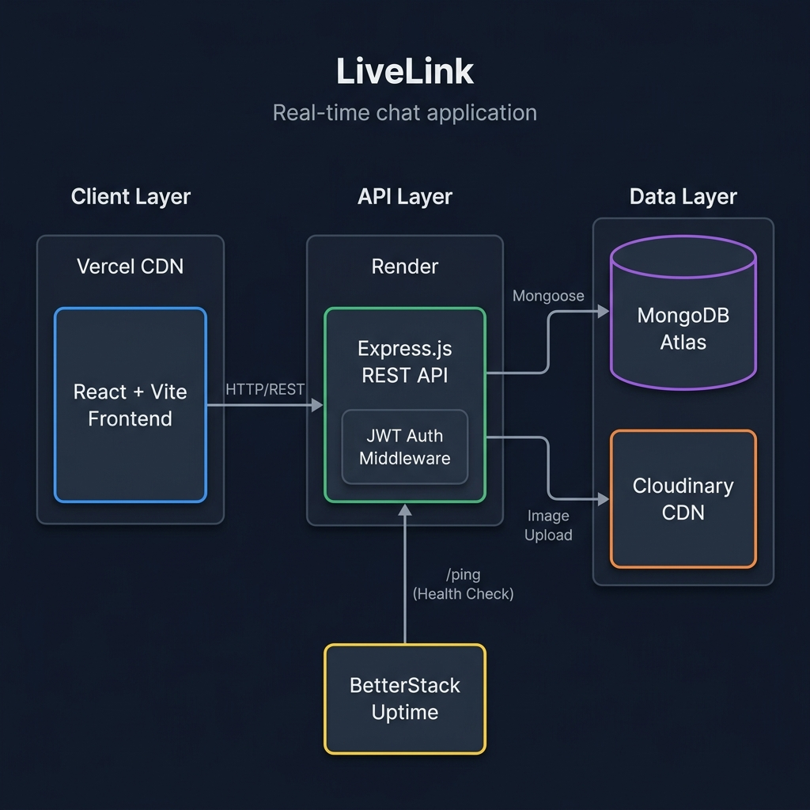
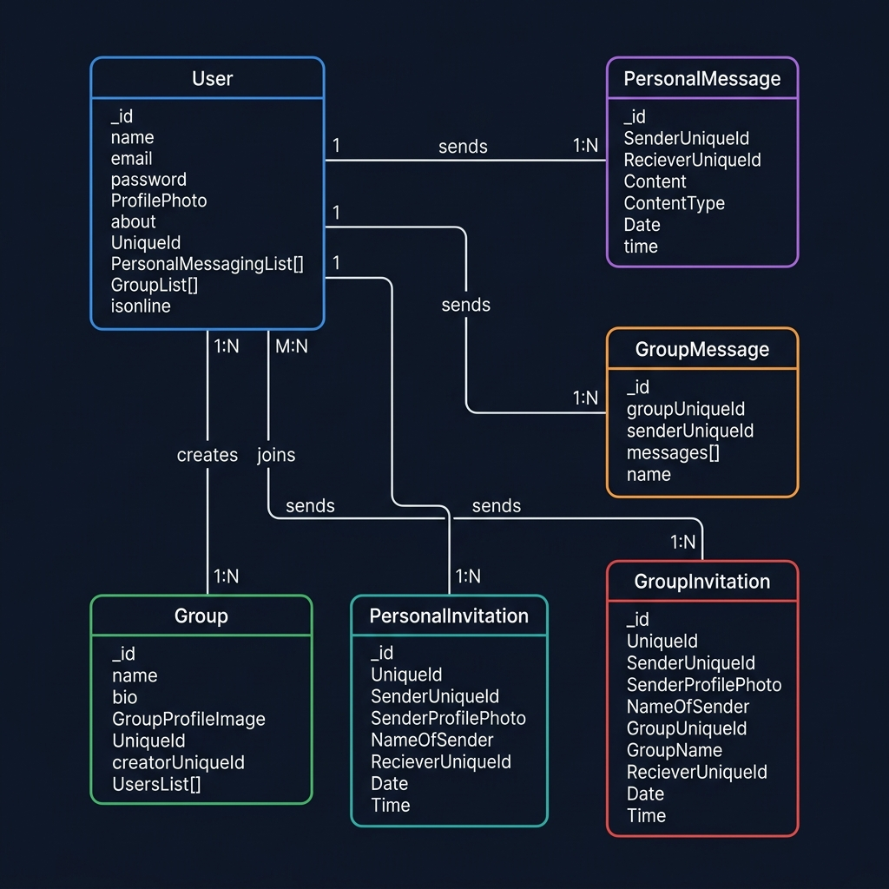

# LiveLink 💬

LiveLink is a full-stack, real-time chat application inspired by WhatsApp. It features seamless user-to-user and group communication, real-time notifications, secure authentication, and media sharing. 

Designed with a modern UI and a robust backend, LiveLink provides a responsive and engaging messaging experience.

## 📖 What is this Project & Use Case

**LiveLink** is designed to bridge the gap between simple chat applications and robust enterprise-grade communication tools. It provides a real-time, bi-directional communication channel where users can securely register, find friends, and engage in personal or group conversations. 

**Use Cases:**
- **Personal Communication:** Chatting with friends and family seamlessly.
- **Team Collaboration:** Creating specific project groups, managing members, and sharing rich media (images, files) for productive workflow.
- **Community Building:** Secure group management with invite and notification systems allows communities to moderate their members effectively.

## ✨ Features

* **Real-Time Messaging:** Instant message delivery for both one-on-one and group chats using WebSockets.
* **Group Management:** Create groups, add or remove members, and manage group information.
* **Secure Authentication:** Email-based verification using OTPs (powered by Nodemailer) and secure password management.
* **Media Sharing:** Upload and share images within chats, integrated seamlessly with Cloudinary.
* **Live Notifications:** Stay updated with real-time alerts for new messages, group invites, and friend requests.
* **Responsive UI:** A beautiful, responsive frontend built with React, Vite, and Tailwind CSS.
* **Profile Customization:** Edit user profiles, manage friend lists, and update avatars.

## 🛠️ Tech Stack

**Frontend**
* React 19
* Vite (Bundler)
* TypeScript
* Tailwind CSS (Styling)
* React Router DOM (Navigation)
* Zod (Data Validation)
* Axios (API calls)
* Lottie React (Animations)

**Backend**
* Node.js & Express.js
* TypeScript
* Cloudinary (Image storage)
* Nodemailer (Email/OTP services)
* Zod (Schema validation)
* Database (Prisma/Mongoose configured in `src/db`)
* Express for routing and maintaining API Endpoints.
* WebSockets for real-time messaging!
* JWT (JSON Web Token) for seamless token authorization.

## 🔄 Workflow & System Design

1. **Client Request:** The user interacts with the React frontend (Vite).
2. **Authentication:** User logs in/signs up. The backend validates credentials using Zod and authenticates using JWT. Email OTP verification is handled via Nodemailer.
3. **Real-time Connection:** Once authenticated, a WebSocket connection is established for live message propagation.
4. **Data Management:** All user data, group mappings, and chat histories are securely stored in the database.
5. **Media Uploads:** Images sent in chats are directly processed and stored in Cloudinary, returning a secure URL to the client.
6. **Notification System:** Invites (personal or group) trigger immediate database updates and real-time alerts to the recipient's dashboard.

## 📐 System Design & Architecture

### High-Level Architecture


### System Architecture Diagram


The application follows a **3-tier architecture**:

| Layer | Technology | Responsibility |
|---|---|---|
| **Client** | React + Vite + Tailwind | UI rendering, routing, state management |
| **API Server** | Express.js + JWT | Business logic, authentication, REST endpoints |
| **Data Layer** | MongoDB Atlas + Cloudinary | Persistent storage, media CDN |

### Request Flow

```
User → React Frontend (Vercel)
        ↓ HTTP/REST (Axios)
     Express.js API (Render)
        ↓ JWT Middleware (Auth Check)
     Route Handler
        ├── MongoDB Atlas (Mongoose ODM) → Data CRUD
        ├── Cloudinary SDK → Image Upload/Retrieval
        └── Nodemailer → OTP Email Dispatch
        ↓ JSON Response
     React Frontend → UI Update
```

### Entity-Relationship (ER) Diagram


### Database Schema Overview

```
┌──────────────────────┐     ┌──────────────────────┐
│        User          │     │       Group           │
├──────────────────────┤     ├──────────────────────┤
│ _id                  │     │ _id                  │
│ name                 │     │ name                 │
│ email                │     │ bio                  │
│ password (hashed)    │     │ GroupProfileImage     │
│ ProfilePhoto         │     │ UniqueId             │
│ about                │     │ creatorUniqueId      │
│ UniqueId             │     │ UsersList[]          │
│ PersonalMessagingList│     └──────────────────────┘
│ GroupList[]          │              │
│ isonline             │              │ M:N
└──────────────────────┘              │
        │ 1:N                         │
        ├──────────────────────────────┤
        │                              │
┌───────┴──────────────┐     ┌────────┴─────────────┐
│  PersonalMessage     │     │   GroupMessage        │
├──────────────────────┤     ├──────────────────────┤
│ SenderUniqueId       │     │ groupUniqueId        │
│ RecieverUniqueId     │     │ senderUniqueId       │
│ Content              │     │ messages[]           │
│ ContentType          │     │ name                 │
│ Date, time           │     │ Date, time           │
└──────────────────────┘     └──────────────────────┘

┌──────────────────────┐     ┌──────────────────────┐
│ PersonalInvitation   │     │  GroupInvitation      │
├──────────────────────┤     ├──────────────────────┤
│ UniqueId             │     │ UniqueId             │
│ SenderUniqueId       │     │ SenderUniqueId       │
│ SenderProfilePhoto   │     │ SenderProfilePhoto   │
│ NameOfSender         │     │ NameOfSender         │
│ RecieverUniqueId     │     │ GroupUniqueId        │
│ Date, Time           │     │ GroupName            │
└──────────────────────┘     │ RecieverUniqueId     │
                             │ Date, Time           │
                             └──────────────────────┘
```

### API Endpoint Map

| Prefix | Router | Purpose |
|---|---|---|
| `/LiveLink/Users` | UserRouter | Auth, profile, search, unfriend |
| `/LiveLink/Users/Groups` | GroupRouter | Create, edit, delete, leave groups |
| `/LiveLink/Users/Message/UserToUser` | PersonalMessageRouter | Send/receive personal messages |
| `/LiveLink/Users/Message/UserToGroup` | GroupMessageRouter | Send/receive group messages |
| `/LiveLink/Users/Personal/Notifications` | PersonalNotificationRouter | Personal invite notifications |
| `/LiveLink/Users/Group/Notifications` | GroupNotificationRouter | Group invite notifications |
| `/LiveLink/Users/Invitation` | InviteFromUserforUserRouter | Accept/reject personal invites |
| `/LiveLink/Users/Groups/Invitation` | InviteFromUserforGroupRouter | Accept/reject group invites |

## 📂 Project Structure

The repository is organized into two main directories:

* `/frontend`: Contains the Vite + React client-side application.
* `/backend`: Contains the Node.js server, API routes, database configuration, and third-party service integrations.

## 🖼️ Application Images


## 🚀 How to Replicate & Get Started

Follow these instructions to set up the project on your local machine for development and testing.

### Prerequisites

* Node.js installed on your machine.
* A Cloudinary account for media storage.
* An email account to configure Nodemailer (e.g., Gmail App Passwords).
* A running database instance.

### 1. Clone the repository
```bash
git clone https://github.com/bhavesh10joshi/livelink.git
cd livelink
```

### 2. Backend Setup

Navigate to the backend directory and install dependencies:
```bash
cd backend
npm install
```

Create a `.env` file in the `backend` directory (refer to `.env.example` if available) and add your environment variables:
```env
PORT=5000
DATABASE_URL=your_database_connection_string
JWT_SECRET=your_jwt_secret
CLOUDINARY_CLOUD_NAME=your_cloudinary_name
CLOUDINARY_API_KEY=your_cloudinary_api_key
CLOUDINARY_API_SECRET=your_cloudinary_api_secret
EMAIL_USER=your_email_address
EMAIL_PASS=your_email_app_password
```

Start the backend development server:
```bash
npm run dev
```

### 3. Frontend Setup

Open a new terminal, navigate to the frontend directory, and install dependencies:
```bash
cd frontend
npm install
```

Start the Vite development server:
```bash
npm run dev
```
Working Link :- `https://live-link-phi.vercel.app/`

## 🌍 Deployment & Performance Optimization

* **Backend:** Successfully configured and deployed on **Render**. 
  * **Sleeping Time Reduction:** To prevent Render's free tier instances from sleeping, a dedicated `/ping` endpoint has been configured. We utilize **BetterStack** (Uptime Monitoring) to ping this endpoint every few minutes, significantly reducing wake-up latency and ensuring the backend remains active.
* **Frontend:** Optimized and deployed on **Vercel**.
  * Framework Preset: Vite
  * Build Command: `npm run build`
  * Output Directory: `dist`
  * Install Command: `npm install`

## 👨‍💻 Author

**Bhavesh Joshi**
